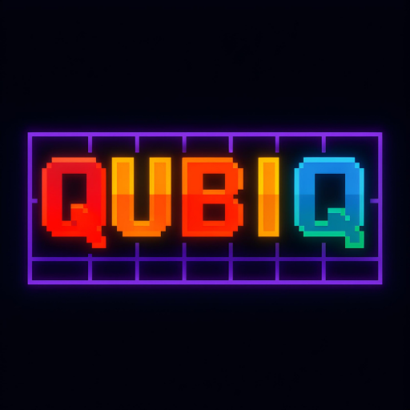

# 🎮 Tetris - Retro Mobile Game

<p align="center">
  
</p>

<p align="center">
  <strong>A modern, retro-styled Tetris game built with React and Capacitor for Android devices</strong>
</p>

<p align="center">
  
  
  
  
</p>

---

## 📱 About

A fully functional Tetris game featuring authentic gameplay mechanics, retro pixel-art aesthetics, and immersive audio. Built as a native Android application using modern web technologies for optimal performance and maintainability.

### ✨ Key Features

- 🎯 **Classic Tetris Gameplay** - All 7 standard Tetrominos (I, O, T, S, Z, J, L)
- 🎲 **7-Bag Random System** - Ensures fair piece distribution (Tetris standard)
- 🎨 **Retro Neon Design** - Pixel-perfect UI with vibrant neon colors
- 🎵 **Immersive Audio** - Background music and sound effects with smart pooling
- 📊 **Score System** - Points for lines cleared, combos, and special moves
- ⚡ **Progressive Difficulty** - Speed increases with level advancement
- 🏆 **High Scores** - Local leaderboard with top 10 scores
- 🎮 **Touch Controls** - Optimized for mobile gameplay
- ⏸️ **Pause System** - Pause anytime with modal overlay
- 📱 **Native Android** - Smooth performance via Capacitor

---

## 🛠️ Tech Stack

### Frontend
- **React 19.1.1** - UI framework with functional components and hooks
- **Vite 7.1.7** - Lightning-fast build tool and dev server
- **Tailwind CSS 4.1.16** - Utility-first CSS framework
- **Phosphor React 1.4.1** - Icon library

### Mobile
- **Capacitor 7.4.4** - Native Android runtime
- **Android SDK 35** - Target Android 15 (Minimum SDK 23 - Android 6.0)
- **Gradle** - Build system for Android

### Development Tools
- **ESLint 9.36.0** - Code linting
- **PostCSS 8.5.6** - CSS processing
- **Autoprefixer 10.4.21** - CSS vendor prefixing

---

## 📂 Project Structure

```
tetris/
├── src/
│   ├── components/         # Reusable UI components
│   │   ├── GameBoard.jsx      # Main Tetris game grid
│   │   ├── NextPiecePreview.jsx  # Shows next piece
│   │   ├── ScorePanel.jsx     # Score/level display
│   │   ├── DecorativeGrid.jsx # Aesthetic grid backgrounds
│   │   ├── RetroButton.jsx    # Styled button component
│   │   └── IconButton.jsx     # Icon-based buttons
│   ├── views/              # Screen components
│   │   ├── SplashScreen.jsx   # App loading screen
│   │   ├── MenuView.jsx       # Main menu
│   │   ├── GameView.jsx       # Active gameplay screen
│   │   ├── InstructionsView.jsx # How to play
│   │   ├── HighScoresView.jsx   # Leaderboard
│   │   └── modals/
│   │       ├── PauseModal.jsx     # Pause overlay
│   │       └── GameOverModal.jsx  # Game over screen
│   ├── contexts/           # React contexts
│   │   └── AudioContext.jsx   # Audio management system
│   ├── hooks/              # Custom React hooks
│   │   ├── useGameLoop.js     # Game loop with requestAnimationFrame
│   │   └── useAudio.js        # Audio hook wrapper
│   ├── utils/              # Utility functions
│   │   └── scores.js          # LocalStorage score management
│   ├── styles/             # Style configurations
│   │   ├── colors.js          # Color palette
│   │   └── theme.js           # Theme definitions
│   ├── assets/             # Static assets
│   │   ├── audio/             # Music and sound effects
│   │   └── *.png              # Images and icons
│   ├── tetrisLogic.js      # Core game logic
│   ├── App.jsx             # Main app component
│   └── main.jsx            # React entry point
├── android/                # Native Android project
│   ├── app/
│   │   ├── src/main/
│   │   │   ├── java/com/joaquin9999/tetris/
│   │   │   │   └── MainActivity.java
│   │   │   ├── AndroidManifest.xml
│   │   │   └── res/          # Android resources
│   │   └── build.gradle      # App build config
│   ├── build.gradle          # Project build config
│   └── gradle.properties     # Gradle settings
├── public/                 # Static public assets
├── capacitor.config.json   # Capacitor configuration
├── vite.config.js          # Vite build configuration
├── tailwind.config.js      # Tailwind CSS configuration
└── package.json            # Dependencies and scripts
```

---

## 🎮 Game Mechanics

### Tetrominos (Pieces)
The game features 7 standard Tetris pieces:
- **I-Piece** (Cyan) - Straight 4-block line
- **O-Piece** (Yellow) - 2×2 square
- **T-Piece** (Purple) - T-shape
- **S-Piece** (Green) - S-shape
- **Z-Piece** (Red) - Z-shape
- **J-Piece** (Blue) - J-shape
- **L-Piece** (Orange) - L-shape

### Random System
Uses the **7-bag system** (Tetris standard):
- All 7 pieces are shuffled into a bag
- Pieces are drawn sequentially
- When bag is empty, a new shuffled bag is created
- Prevents long droughts or floods of any piece type

### Scoring
- **Single Line**: 100 × level
- **Double Lines**: 300 × level
- **Triple Lines**: 500 × level
- **Tetris (4 lines)**: 800 × level
- **Soft Drop**: 1 point per cell
- **Hard Drop**: 2 points per cell

### Controls
- **← →** - Move piece left/right
- **↓** - Soft drop (faster fall)
- **↑ / Rotate button** - Rotate piece clockwise
- **Fast button** - Hard drop (instant placement)

---

## 🚀 Getting Started

### Prerequisites
- **Node.js** 18+ and npm
- **Android Studio** (for building Android app)
- **JDK 17** (for Android builds)

### Installation

1. **Clone the repository**
   ```bash
   git clone <repository-url>
   cd tetris
   ```

2. **Install dependencies**
   ```bash
   npm install
   ```

3. **Configure Android SDK** (if not already configured)
   - Open Android Studio
   - Go to **Tools → SDK Manager**
   - Install **Android SDK 35** (Android 15)
   - Install **Android SDK Platform-Tools**
   - Install **Android SDK Build-Tools**

---

## 💻 Development

### Run Development Server
```bash
npm run dev
```
Opens at `http://localhost:5173`

### Build for Production
```bash
npm run build
```
Outputs to `dist/` directory

### Preview Production Build
```bash
npm run preview
```

### Lint Code
```bash
npm run lint
```

---

## 📱 Building for Android

### Sync with Capacitor
```bash
npm run cap:sync
```
Builds the web app and copies assets to Android project

### Open in Android Studio
```bash
npm run cap:open:android
```

### Build and Run on Device
```bash
npm run cap:run:android
```

### Manual Build in Android Studio
1. Run `npm run build`
2. Run `npx cap sync android`
3. Open Android Studio
4. Click **Build → Clean Project**
5. Click **Build → Rebuild Project**
6. Connect device or start emulator
7. Click **Run ▶️**

---

## 📦 Deployment

### Generate Signed APK

1. **Create Keystore** (first time only)
   ```bash
   keytool -genkey -v -keystore tetris-release-key.jks \
     -keyalg RSA -keysize 2048 -validity 10000 \
     -alias tetris
   ```

2. **Configure Signing in Android Studio**
   - Go to **Build → Generate Signed Bundle/APK**
   - Select **APK**
   - Choose keystore and enter credentials
   - Select **release** build variant
   - Click **Finish**

3. **Output Location**
   ```
   android/app/build/outputs/apk/release/app-release.apk
   ```

### Upload to Google Play

1. **Create App in Google Play Console**
   - Package name: `com.joaquin9999.tetris`
   - Upload APK or AAB (Android App Bundle)

2. **Fill Store Listing**
   - App name: **Tetris - Classic Block Puzzle Game**
   - Short description: 80 characters
   - Full description: 4000 characters (available on request)
   - Screenshots: 1080×1920 (phone), 1920×1080 (landscape)
   - Feature graphic: 1024×500
   - App icon: 512×512

3. **Content Rating**
   - Fill IARC questionnaire
   - Tetris typically rates E (Everyone)

4. **Pricing & Distribution**
   - Set free or paid
   - Select countries
   - Accept policies

5. **Submit for Review**

---

## 🎨 Customization

### Colors
Edit `src/styles/colors.js` to change the neon color palette:
```javascript
export const COLORS = {
  cyan: '#00ffff',
  yellow: '#ffff00',
  // ... modify as needed
};
```

### Audio
Replace files in `src/assets/audio/`:
- `background-music.mp3` - Background music loop
- `buttonClick.mp3` - UI button sound
- `rotate.mp3` - Piece rotation sound
- `lineClear.mp3` - Line clear sound

### Game Settings
Modify `src/tetrisLogic.js`:
- `INITIAL_FALL_SPEED` - Starting fall speed
- `ROWS` / `COLS` - Grid dimensions
- `calculateScore()` - Scoring formula
- `updateGameState()` - Level progression

---

## 🐛 Known Issues & Solutions

### Audio Not Playing
- Ensure audio files are in `src/assets/audio/`
- Check Android permissions in `AndroidManifest.xml`
- Verify `android:extractNativeLibs="true"` is set

### Build Errors
- Run `npm run build` before `npx cap sync`
- Clean Android project: **Build → Clean Project**
- Invalidate caches: **File → Invalidate Caches / Restart**

### Package Name Conflicts
- Package: `com.joaquin9999.tetris`
- Update in: `capacitor.config.json`, `build.gradle`, `AndroidManifest.xml`, `strings.xml`, `MainActivity.java`

---

## 📄 License

This project is licensed under the **MIT License**.

---

## 👤 Author

**Joaquin** (21neji)
- GitHub: [@21neji](https://github.com/21neji)
- Package: `com.joaquin9999.tetris`

---

## 🙏 Acknowledgments

- Tetris game design © The Tetris Company
- 7-bag random system from Tetris Guidelines
- Retro pixel art aesthetic inspiration
- React and Capacitor communities

---

## 📞 Support

For issues or questions:
1. Check the **Known Issues** section above
2. Review Android Studio build logs
3. Verify all dependencies are installed
4. Ensure Android SDK 35 is configured

---

<p align="center">
  Made with ❤️ using React + Capacitor
</p>

<p align="center">
  <strong>Ready to play? Build and deploy! 🚀</strong>
</p>